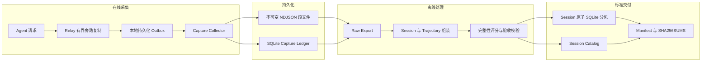

# Agent 轨迹训练数据流水线

面向 Agent 交互轨迹的可靠采集、完整 Session 整理、质量评分与标准化交付工具。

本项目将在线转发与数据采集解耦。Relay 负责旁路复制和本地可靠暂存，Collector 负责保存原始证据，离线命令负责 Session 组装、轨迹索引、完整性评分和交付打包。采集入口保留成功、失败、取消和重试记录，质量筛选只在版本化的离线数据集中执行。

## 核心能力

- 使用本地磁盘 outbox 保存待投递数据，支持重启恢复和同一 `captureId` 幂等重试。
- Collector 完成段文件 `fsync` 和 SQLite ledger 提交后返回持久化确认。
- 完整保留 HTTP 408、429、5xx、上游错误、不完整响应和取消结果。
- 使用 `open -> sealed` 段文件生命周期和 SHA-256 校验保护原始数据。
- 按 `sourceNamespace + session_id/thread_id` 组装完整 Session。
- 索引 Response DAG、父子 Session、工具定义、工具调用结果和生命周期事件。
- 并行导出压缩 SQLite，按 Session 原子性生成约 10 GiB 的交付分包。
- 自动计算轨迹完整性分数，语义奖励作为独立的可空字段保存。
- 发布前校验记录数、字节数、哈希、外键、SQLite 完整性和 Session 不拆分约束。

## 系统架构



| 组件 | 职责 | 边界 |
| --- | --- | --- |
| Relay | 有界复制、提取显式 Trace 标识、写入本地 outbox | 不执行训练质量判断和语义评分 |
| Outbox | 原子落盘、重启恢复、字节不变重试、积压守恒 | 不修改或重新生成原始响应 |
| Collector | 校验、规范化、幂等持久化、段生命周期和 attempt ledger | 不丢弃失败样本，不推断缺失事件 |
| Raw Export | 从 sealed 段生成经过校验的压缩 SQLite | 不声明 Session 完整性 |
| Trajectory / Release | Session 组装、DAG 索引、完整性评分、原子分包 | 无 evaluator 时不生成语义奖励 |

核心标识来自实际采集字段：

```text
capture_id    = captureId
trajectory_id = sha256(source_namespace + NUL + (session_id or thread_id))
turn_key      = sha256(trajectory_id + NUL + turn_id)
call_key      = sha256(trajectory_id + NUL + native_call_id)
```

缺少 Session 标识的记录会进入单记录 orphan trajectory。未观察到的工具结果、父响应、生命周期事件和任务奖励保持缺失状态。

## 环境要求

- Linux
- Python 3.10 或更高版本
- Node.js 20 或更高版本，用于 Relay 集成和 JavaScript 测试
- 本地持久化文件系统，用于 live SQLite ledger 和 Relay outbox
- NFS、对象存储或数据卷，用于不可变 sealed 段和发布目录

## 安装

```bash
python3 -m venv .venv
source .venv/bin/activate
python3 -m pip install --upgrade pip
python3 -m pip install -e '.[performance]'
```

安装后使用 `trace-pipeline`，也可以通过 `python3 -m trace_pipeline` 调用相同命令。

## 快速开始

先运行隔离自测：

```bash
make self-test
```

启动本地 Collector：

```bash
export TRACE_DEMO_ROOT=/var/tmp/trace-pipeline-demo
mkdir -p "$TRACE_DEMO_ROOT/capture" "$TRACE_DEMO_ROOT/state"

trace-pipeline serve \
  --root "$TRACE_DEMO_ROOT/capture" \
  --state-root "$TRACE_DEMO_ROOT/state" \
  --host 127.0.0.1 \
  --port 3010
```

在另一个终端提交一条采集记录。重复提交相同内容会返回 `duplicate`，不会生成第二条物理记录：

```bash
curl --fail-with-body http://127.0.0.1:3010/capture \
  -H 'content-type: application/json' \
  --data-binary @- <<'JSON'
{
  "captureId": "cap-readme-example-001",
  "sourceNamespace": "readme-demo",
  "startedAt": "2026-08-26T00:00:00Z",
  "finishedAt": "2026-08-26T00:00:01Z",
  "requestBodyText": "{\"model\":\"target-model-v1\",\"client_metadata\":{\"session_id\":\"session-001\",\"turn_id\":\"turn-001\"},\"input\":[{\"role\":\"user\",\"content\":\"hello\"}]}",
  "responseStatus": 200,
  "responseBodyText": "{\"id\":\"response-001\",\"status\":\"completed\",\"output\":[],\"usage\":{}}",
  "requestTruncated": false,
  "responseTruncated": false,
  "stream": false,
  "captureError": null,
  "traceContext": {
    "session_id": "session-001",
    "turn_id": "turn-001"
  },
  "observedLifecycleEvents": ["response.completed"]
}
JSON
```

检查运行状态和持久化一致性：

```bash
curl --fail http://127.0.0.1:3010/health | python3 -m json.tool
curl --fail http://127.0.0.1:3010/audit | python3 -m json.tool
```

## Relay 接入

`integration/durable_capture_outbox.js` 提供本地先落盘、后台投递、
重启恢复和冲突隔离。Relay 为每条记录生成稳定的 `captureId`，
序列化一次后写入 outbox：

```javascript
const { DurableCaptureOutbox } = require('./integration/durable_capture_outbox');

const outbox = new DurableCaptureOutbox({
  directory: '/var/lib/trace-relay/outbox',
  url: 'http://127.0.0.1:3010',
});

await outbox.enqueue(captureEnvelope);
```

收到 `durable: true` 后 outbox 才删除本地文件。超时属于未确认状态，
Relay 使用同一 ID 和相同字节重试。HTTP 409 进入 `conflicts/`，
不可重试的请求错误进入 `failed/`。

## 离线处理与交付

Collector 只从 sealed 段导出数据。停止服务会封存当前段，运行中的服务按大小或时间自动轮转。

```bash
trace-pipeline export \
  --root "$TRACE_DEMO_ROOT/capture" \
  --ledger "$TRACE_DEMO_ROOT/state/capture-ledger.sqlite" \
  --output "$TRACE_DEMO_ROOT/raw-001.sqlite" \
  --compression-codec zstd \
  --compression-level 1

trace-pipeline release \
  --input "$TRACE_DEMO_ROOT/raw-001.sqlite" \
  --output "$TRACE_DEMO_ROOT/target-model-v1-release" \
  --model target-model-v1 \
  --target-part-gib 10
```

大规模数据使用 `export-sharded` 并行生成 raw shards，再将所有 shard
作为多个 `--input` 传给 `release`。Raw shard 可以跨 Session，
最终 release 不拆分 Session。

```text
target-model-v1-release/
├── manifest.json
├── SHA256SUMS
├── session-catalog.sqlite
├── target-model-v1-part-001.sqlite
├── target-model-v1-part-002.sqlite
└── ...
```

交付目录和验收字段见[交付规范](docs/delivery.md)。

## 轨迹完整性评分

内置评分衡量采集到的 Session 是否结构完整，不代表回答正确性或任务奖励。

| 组成 | 分值 | 检查内容 |
| --- | ---: | --- |
| Payload | 20 | 可解析且未截断 |
| Session / Turn Identity | 20 | Session 和 Turn 标识覆盖率 |
| Terminal | 20 | 完成、失败、取消或不完整终态已被观察 |
| Usage | 5 | API Token 用量存在 |
| Tool Linkage | 20 | 工具调用与真实结果完成关联 |
| Boundary | 15 | Session 左右边界完整 |

`session_completeness_score` 范围为 0 到 100。没有 evaluator、
测试结果或 ground truth 时，`reward` 和 `reward_source` 保持
`null`。工具调用状态区分 `executed`、`abandoned_concurrent`、
`abandoned_retry`、`open_tail` 和 `capture_gap`。

## 命令

| 命令 | 用途 |
| --- | --- |
| `serve` | 启动兼容 `POST /capture` 的 Collector |
| `audit` | 只读审计 ledger、段文件和 payload locator |
| `export` | 将 sealed 段导出为一个经过校验的 raw SQLite |
| `export-sharded` | 并行导出多个 raw SQLite shard |
| `trajectory` | 构建指定模型投影或完整 thread 的轨迹目录 |
| `release` | 构建 Session 原子的标准交付目录 |
| `self-test` | 运行隔离的持久化与交付冒烟测试 |

使用 `trace-pipeline <command> --help` 查看完整参数。

## 项目结构

```text
trace-training-pipeline/
├── .github/workflows/       # 持续集成
├── deploy/                  # Docker Compose 与 systemd 部署文件
├── docs/                    # 架构、数据契约、交付和运维文档
├── integration/             # Relay outbox 与 Trace 上下文提取
├── scripts/                 # 自测、导出和性能脚本
├── src/trace_pipeline/      # Collector、存储、导出和轨迹实现
├── tests/                   # Python 与 JavaScript 测试
├── CHANGELOG.md             # 版本变更记录
├── CONTRIBUTING.md          # 贡献指南
├── SECURITY.md              # 安全策略
├── Dockerfile
├── Makefile
└── pyproject.toml
```

## 开发与验证

```bash
make test
make self-test
make benchmark-pack
```

`benchmark-pack` 只验证编解码吞吐。端到端性能报告同时记录硬件、文件系统、缓存状态、输入分布、持续时间和完整性校验结果。性能边界和验收方法见[架构与性能](docs/architecture.md)。

## 安全

原始请求、响应、工具参数和工具结果均按敏感数据处理。兼容入口会移除常见凭据 Header，但不对正文执行内容级脱敏。部署方负责数据授权、访问控制、静态加密、保留期限和删除策略。

Collector 默认不提供应用层认证或 TLS，必须绑定 loopback、可信内网
或受认证的入口。安全问题按[安全策略](SECURITY.md)报告，不要在公开
Issue 中提交凭据、私有地址或真实交互正文。

## 文档

- [架构与性能](docs/architecture.md)
- [数据契约](docs/data-contract.md)
- [交付规范](docs/delivery.md)
- [部署与运维](docs/operations.md)
- [OpenAPI 规范](src/trace_pipeline/specs/openapi.yaml)
- [变更记录](CHANGELOG.md)
- [贡献指南](CONTRIBUTING.md)

## 许可证

本项目使用 [Apache License 2.0](LICENSE)。
