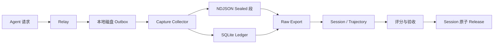
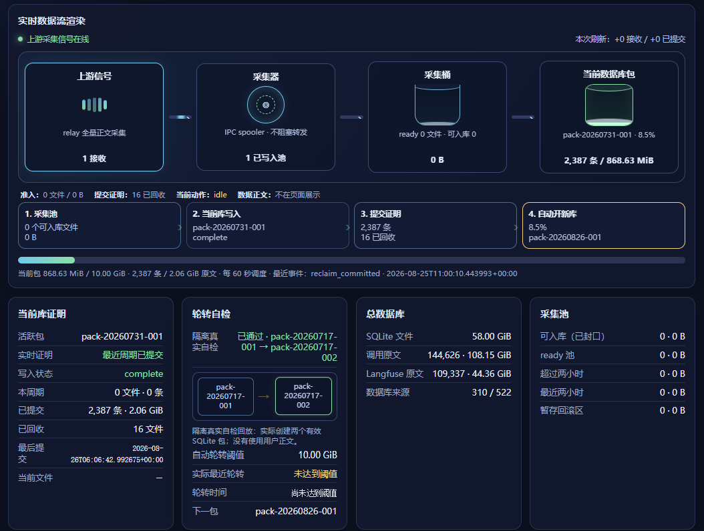

# 芯迹（ChipTrace）

万总一芯团队的芯片行业 Trace 治理框架。

Relay 负责旁路复制和本地 outbox，Collector 持久化原始证据，
离线命令负责轨迹组装、校验和分包。采集入口保留真实成功、失败、
取消和重试记录，质量筛选在离线投影中执行。

## 核心能力

- 本地磁盘 outbox：原子落盘、重启恢复、同一 `captureId` 幂等重试。
- Collector：段文件与 SQLite ledger 双重持久化确认，保留完整响应状态。
- Trace 上下文：记录 Session、Turn、Goal、Agent、Branch 和 Response 链标识。
- Trajectory：组装 Session DAG，保存工具 schema、调用、结果和生命周期事件。
- Release：并行压缩、Session 原子分包、完整性评分、Manifest 和 SHA-256 校验。

## 系统架构





实时采集、入库、轮转和交付状态示例。

## 安装

要求 Python 3.10+、Node.js 20+ 和本地持久化文件系统。

```bash
python3 -m venv .venv
source .venv/bin/activate
python3 -m pip install -e '.[performance]'
make self-test
```

## 运行 Collector

```bash
export CHIPTRACE_ROOT=/var/tmp/chiptrace
mkdir -p "$CHIPTRACE_ROOT/capture" "$CHIPTRACE_ROOT/state"
chiptrace serve \
  --root "$CHIPTRACE_ROOT/capture" \
  --state-root "$CHIPTRACE_ROOT/state" \
  --host 127.0.0.1 \
  --port 3010
```

提交一条采集记录并检查状态：

```bash
curl --fail http://127.0.0.1:3010/capture \
  -H 'content-type: application/json' \
  --data '{"captureId":"cap-demo-001","responseStatus":200,"requestBodyText":"{}","responseBodyText":"{}"}'
curl --fail http://127.0.0.1:3010/health | python3 -m json.tool
```

## 处理与交付

```bash
chiptrace export \
  --root "$CHIPTRACE_ROOT/capture" \
  --ledger "$CHIPTRACE_ROOT/state/capture-ledger.sqlite" \
  --output "$CHIPTRACE_ROOT/raw.sqlite" \
  --compression-codec zstd \
  --compression-level 1

chiptrace release \
  --input "$CHIPTRACE_ROOT/raw.sqlite" \
  --output "$CHIPTRACE_ROOT/release" \
  --model target-model-v1 \
  --target-part-gib 10
```

大规模数据先使用 `export-sharded` 生成 raw shards，再将多个 shard
传给 `release`。Release 保证一个 Session 只进入一个 Part。

交付目录：

```text
release/
├── manifest.json
├── SHA256SUMS
├── session-catalog.sqlite
└── target-model-v1-part-*.sqlite
```

## 质量与边界

- 完整性分数范围为 0-100，覆盖 Payload、Identity、Terminal、Usage、Tool Linkage 和 Boundary。
- Session 身份使用 `sourceNamespace + session_id/thread_id`；缺失身份、截断和未配对工具保持显式。
- `reward` 只在接入 evaluator 或 ground truth 后写入；结构分数不代表任务正确性。
- 请求、响应和工具数据按敏感原始数据处理；Collector 默认监听 loopback，不执行正文脱敏。

字段、状态和评分规则见[数据契约](docs/data-contract.md)；交付验收见[交付规范](docs/delivery.md)。

## 项目结构

```text
chiptrace/
├── deploy/                  # Docker Compose 与 systemd
├── docs/                    # 架构、契约、交付、运维和图片资源
├── integration/             # Relay outbox 与 Trace 上下文
├── scripts/                 # 自测、导出和性能脚本
├── src/trace_pipeline/      # Collector 与离线处理实现
├── tests/                   # Python 与 JavaScript 测试
├── README.md
├── LICENSE
├── Dockerfile
├── Makefile
├── MANIFEST.in
└── pyproject.toml
```

## 文档

- [架构与性能](docs/architecture.md)
- [数据契约](docs/data-contract.md)
- [交付规范](docs/delivery.md)
- [部署与运维](docs/operations.md)
- [OpenAPI 规范](src/trace_pipeline/specs/openapi.yaml)

使用 `chiptrace <command> --help` 查看完整参数。`trace-pipeline` 仍作为兼容别名提供。

## 许可证

本项目使用 [Apache License 2.0](LICENSE)。
