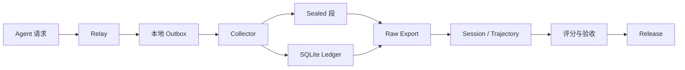

# 芯迹（ChipTrace）

<p align="center">
  <a href="https://github.com/XS-MLVP">
    
  </a>
</p>

<p align="center">
  <a href="https://github.com/XS-MLVP"><strong>万众一芯开放验证（UnityChip Verification）</strong></a>
  ·
  <a href="https://open-verify.cc/">官方网站</a>
</p>

面向芯片行业 Agent Trace 的采集、轨迹组装、质量校验和数据交付工具。

## 功能

- 在线采集：持久化请求、响应、工具调用和生命周期状态。
- 离线处理：导出原始数据，组装 Session / Trajectory，执行校验和评分。
- 数据交付：按 Session 原子分包，生成 Manifest、SHA-256 和 `tar.gz` 归档。
- 集成组件：提供 Node.js Durable Outbox 和 Trace 上下文提取器。

## 安装

要求 Python 3.10+；使用 Node.js 集成组件时要求 Node.js 20+。

```bash
python3 -m venv .venv
source .venv/bin/activate
python3 -m pip install -e '.[performance]'
```

运行自测：

```bash
make self-test
npm test
```

## 快速开始

### 启动 Collector

```bash
export CHIPTRACE_ROOT=/var/tmp/chiptrace
mkdir -p "$CHIPTRACE_ROOT/capture" "$CHIPTRACE_ROOT/state"

chiptrace serve \
  --root "$CHIPTRACE_ROOT/capture" \
  --state-root "$CHIPTRACE_ROOT/state" \
  --host 127.0.0.1 \
  --port 3010
```

### 提交采集记录

```bash
curl --fail http://127.0.0.1:3010/capture \
  -H 'content-type: application/json' \
  --data '{"captureId":"cap-demo-001","responseStatus":200,"requestBodyText":"{}","responseBodyText":"{}"}'

curl --fail http://127.0.0.1:3010/health | python3 -m json.tool
curl --fail -X POST http://127.0.0.1:3010/flush | python3 -m json.tool
```

`/flush` 会封存当前 open 段；导出只读取已封存的段。服务默认只监听
loopback，`/flush` 供本地运维调用。

### 接入 Relay Outbox

```javascript
const { DurableCaptureOutbox } = require('chiptrace/outbox');

const outbox = new DurableCaptureOutbox({
  directory: '/var/lib/chiptrace/outbox',
  url: 'http://127.0.0.1:3010',
  concurrency: 8,
});

(async () => {
  await outbox.enqueue(captureEnvelope);
})();
```

`enqueue` 在本地文件落盘后确认；进程重启会恢复 pending 文件，并使用同一
`captureId` 进行幂等投递。Relay 负责构造 capture envelope 和转发上游请求，
Collector 不替换上游响应，也不接管业务端口。

## 离线处理

封存后导出原始 SQLite：

```bash
chiptrace export \
  --root "$CHIPTRACE_ROOT/capture" \
  --ledger "$CHIPTRACE_ROOT/state/capture-ledger.sqlite" \
  --output "$CHIPTRACE_ROOT/raw.sqlite" \
  --compression-codec zstd \
  --compression-level 1
```

组装轨迹并生成交付目录：

```bash
chiptrace trajectory \
  --input "$CHIPTRACE_ROOT/raw.sqlite" \
  --output "$CHIPTRACE_ROOT/trajectory-catalog.sqlite" \
  --model target-model-v1

chiptrace release \
  --input "$CHIPTRACE_ROOT/raw.sqlite" \
  --output "$CHIPTRACE_ROOT/release" \
  --model target-model-v1 \
  --target-part-gib 10

chiptrace verify-release --release "$CHIPTRACE_ROOT/release"
chiptrace archive-release \
  --release "$CHIPTRACE_ROOT/release" \
  --output "$CHIPTRACE_ROOT/release.tar.gz"
```

大规模数据可先使用 `export-sharded` 生成多个 raw shard，再将多个 shard
传给 `trajectory` 或 `release`。

交付目录示例：

```text
release/
├── manifest.json
├── SHA256SUMS
├── session-catalog.sqlite
└── target-model-v1-part-*.sqlite
```

## 工作流

Relay 旁路复制并写入本地 outbox，Collector 持久化原始证据，离线命令负责
轨迹组装、校验和分包。采集入口保留成功、失败、取消和重试记录，质量筛选
在离线投影中执行。




## 能力说明

- Outbox：原子落盘、重启恢复、同一 `captureId` 幂等重试。
- Collector：段文件与 SQLite ledger 双重持久化确认，保留完整响应状态。
- Trace 上下文：记录 Session、Turn、Goal、Agent、Branch 和 Response 链标识。
- Trajectory：组装 Session DAG，保存工具 schema、调用、结果和生命周期事件。
- Release：并行压缩、Session 原子分包、完整性评分、Manifest 和 SHA-256 校验。

## 质量与边界

- 完整性分数范围为 0-100，覆盖 Payload、Identity、Terminal、Usage、Tool Linkage 和 Boundary。
- Session 身份使用 `sourceNamespace + session_id/thread_id`；缺失身份、截断和未配对工具保持显式。
- `reward` 在接入 evaluator 或 ground truth 后写入；结构分数不代表任务正确性。
- 请求、响应和工具数据按敏感原始数据处理；Collector 默认监听 loopback，不执行正文脱敏。

字段、状态和评分规则见[数据契约](docs/data-contract.md)；交付验收见[交付规范](docs/delivery.md)。

## 项目结构

```text
chiptrace/
├── deploy/                  # Docker Compose 与 systemd
├── docs/                    # 架构、契约、交付、运维和图片资源
├── integration/             # Relay outbox 与 Trace 上下文
├── scripts/                 # 自测、导出和性能脚本
├── src/chiptrace/           # Collector 与离线处理实现
├── tests/                   # Python 与 JavaScript 测试
├── package.json             # Node.js 集成入口
├── README.md
├── LICENSE
├── Dockerfile
├── Makefile
├── MANIFEST.in
└── pyproject.toml
```

## 文档

- [架构与性能](docs/architecture.md)
- [数据契约](docs/data-contract.md)
- [交付规范](docs/delivery.md)
- [部署与运维](docs/operations.md)
- [OpenAPI 规范](src/chiptrace/specs/openapi.yaml)

使用 `chiptrace <command> --help` 查看完整参数。

## 许可证

本项目使用 [Apache License 2.0](LICENSE)。
