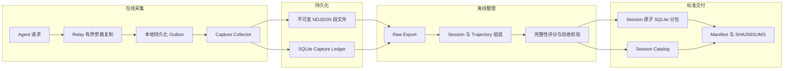

# Agent 轨迹训练数据流水线

> 当前版本：`0.4.0a1`（实验性 Alpha）
> 持久化格式均带版本，但首个稳定版本发布前，轨迹字段和评分策略仍可能调整。

面向 Agent 交互轨迹的可靠采集、完整 session 整理与训练数据标准化交付流水线。

本项目将在线转发与数据采集解耦：Relay 只负责旁路复制和本地可靠暂存，Collector
负责持久化原始证据，离线任务负责 session 组装、轨迹索引、完整性评分和交付打包。
采集层保留成功、失败、取消和重试记录，不在入口按质量过滤数据。

## 核心能力

- 本地磁盘 outbox，支持进程重启恢复和同一 `captureId` 幂等重试；
- Collector 在段文件 `fsync` 和 SQLite ledger 提交后才返回持久化确认；
- 保留 HTTP 408、429、5xx、上游错误、不完整响应和取消结果；
- 原始段文件采用明确的 `open -> sealed` 生命周期和 SHA-256 校验；
- 按 `sourceNamespace + session_id/thread_id` 组装完整 session；
- 索引 response DAG、父子 session、工具定义、工具调用结果和生命周期事件；
- 并行导出压缩 SQLite，并按 session 原子性生成约 10 GiB 的交付分包；
- 自动计算轨迹完整性分数，同时将语义 reward 保持为独立的可空字段；
- 发布前校验记录数、字节数、哈希、外键、SQLite 完整性和 session 不拆分约束。

## 整体架构



| 层级 | 职责 | 明确不负责 |
| --- | --- | --- |
| Relay 集成 | 有界复制、提取显式 trace 标识、写入本地 outbox | 训练质量判断、语义评分 |
| 本地 outbox | 原子落盘、重启恢复、字节不变重试、积压守恒 | 修改或重新生成原始响应 |
| Collector | 校验、规范化、幂等持久化、段生命周期和 attempt ledger | 丢弃失败样本、推断缺失事件 |
| Raw Export | 从 sealed 段生成经过校验的压缩 SQLite | 声明 session 完整性 |
| Trajectory / Release | session 组装、DAG 索引、完整性评分、原子分包 | 在无 evaluator 时伪造 semantic reward |

## 数据边界

核心标识均来自实际采集字段，不会补造缺失关系：

```text
capture_id    = captureId
trajectory_id = sha256(source_namespace + NUL + (session_id or thread_id))
turn_key      = sha256(trajectory_id + NUL + turn_id)
call_key      = sha256(trajectory_id + NUL + native_call_id)
```

缺少 session 标识的记录会成为显式的单记录 orphan trajectory。未观察到的工具结果、
父响应、生命周期事件和任务 reward 均保持缺失状态，而不是按成功处理。

详细字段约束见 [数据契约](docs/data-contract.md) 和
[Capture Envelope JSON Schema](src/trace_pipeline/specs/capture-envelope-v3.schema.json)。

## 环境要求

- Linux；
- Python 3.10 或更高版本；
- Node.js 20 或更高版本，仅用于 Relay 集成和 JavaScript 测试；
- live SQLite ledger 应位于本地持久化文件系统；
- NFS 或对象存储适合保存不可变 sealed 段和已发布数据；
- zstd 和高性能 JSON 支持通过可选依赖安装。

## 安装

```bash
python3 -m venv .venv
source .venv/bin/activate
python3 -m pip install --upgrade pip
python3 -m pip install -e '.[performance]'
```

安装完成后可使用 `trace-pipeline` 命令，也可以通过
`python3 -m trace_pipeline` 调用相同功能。

## 快速开始

先执行隔离自测：

```bash
make self-test
```

启动一个本地 Collector：

```bash
export TRACE_DEMO_ROOT=/var/tmp/trace-pipeline-demo
mkdir -p "$TRACE_DEMO_ROOT/capture" "$TRACE_DEMO_ROOT/state"

trace-pipeline serve \
  --root "$TRACE_DEMO_ROOT/capture" \
  --state-root "$TRACE_DEMO_ROOT/state" \
  --host 127.0.0.1 \
  --port 3010
```

在另一个终端提交一条完整示例。重复执行会返回 `duplicate`，不会产生第二条物理记录：

```bash
curl --fail-with-body http://127.0.0.1:3010/capture \
  -H 'content-type: application/json' \
  --data-binary @- <<'JSON'
{
  "captureId": "cap-readme-example-001",
  "sourceNamespace": "readme-demo",
  "startedAt": "2026-08-26T00:00:00Z",
  "finishedAt": "2026-08-26T00:00:01Z",
  "requestBodyText": "{\"model\":\"target-model-v1\",\"client_metadata\":{\"session_id\":\"session-001\",\"turn_id\":\"turn-001\"},\"input\":[{\"role\":\"user\",\"content\":\"hello\"}]}",
  "responseStatus": 200,
  "responseBodyText": "{\"id\":\"response-001\",\"status\":\"completed\",\"output\":[],\"usage\":{}}",
  "requestTruncated": false,
  "responseTruncated": false,
  "stream": false,
  "captureError": null,
  "traceContext": {
    "session_id": "session-001",
    "turn_id": "turn-001"
  },
  "observedLifecycleEvents": ["response.completed"]
}
JSON
```

健康检查和只读审计：

```bash
curl --fail http://127.0.0.1:3010/health | python3 -m json.tool
curl --fail http://127.0.0.1:3010/audit | python3 -m json.tool
```

## 离线整理与交付

Collector 只从 sealed 段导出数据。停止服务会安全关闭当前段，也可以等待按大小或时间自动
轮转。以下示例生成原始 SQLite，再按完整 session 交付：

```bash
trace-pipeline export \
  --root "$TRACE_DEMO_ROOT/capture" \
  --ledger "$TRACE_DEMO_ROOT/state/capture-ledger.sqlite" \
  --output "$TRACE_DEMO_ROOT/raw-001.sqlite" \
  --compression-codec zstd \
  --compression-level 1

trace-pipeline release \
  --input "$TRACE_DEMO_ROOT/raw-001.sqlite" \
  --output "$TRACE_DEMO_ROOT/target-model-v1-release" \
  --model target-model-v1 \
  --target-part-gib 10
```

数据量较大时，先使用 `export-sharded` 并行生成 raw shards，再把全部 shard 作为多个
`--input` 传给 `release`。Raw shard 可以跨 session，最终 release 不会拆分 session。

标准交付目录如下：

```text
target-model-v1-release/
├── manifest.json
├── SHA256SUMS
├── session-catalog.sqlite
├── target-model-v1-part-001.sqlite
├── target-model-v1-part-002.sqlite
└── ...
```

目录含义和验收字段见 [标准交付模板](docs/delivery-template.md)。

## 轨迹完整性评分

内置评分用于衡量“采集到的 session 是否结构完整”，不等于回答正确性或任务奖励。

| 组成 | 分值 | 检查内容 |
| --- | ---: | --- |
| Payload | 20 | 可解析、未截断 |
| Session / Turn Identity | 20 | session 和 turn 标识覆盖率 |
| Terminal | 20 | 完成、失败、取消或不完整终态是否被观察到 |
| Usage | 5 | API token 用量是否存在 |
| Tool Linkage | 20 | 工具调用与真实结果是否关联 |
| Boundary | 15 | session 左右边界是否完整 |

`session_completeness_score` 的范围为 0 到 100。没有 evaluator、测试结果或 ground truth
时，`reward` 和 `reward_source` 保持 `null`。工具调用状态会区分 `executed`、
`abandoned_concurrent`、`abandoned_retry`、`open_tail` 和 `capture_gap`。

## 可靠性约束

- 同一 `captureId` 和相同字节返回幂等成功；同一 ID 对应不同字节返回 HTTP 409；
- HTTP 202 仅表示原始段和 ledger 已完成配置的持久化边界；
- Relay outbox 只有在收到明确的 `durable: true` 后才删除本地文件；
- 超时属于不确定结果，发送端必须使用相同 ID 和相同字节重试；
- 408、429、5xx、失败、取消和上游错误均属于需要保留的真实观测；
- 发布目录采用临时构建、完整校验、文件同步和原子发布；
- 每个交付文件都写入 `SHA256SUMS`，SQLite 必须通过 integrity 和 foreign-key 检查。

## 常用命令

| 命令 | 用途 |
| --- | --- |
| `serve` | 启动兼容 `POST /capture` 的 Collector |
| `audit` | 只读审计 ledger、段文件和 payload locator |
| `export` | 将 sealed 段导出为一个经过校验的 raw SQLite |
| `export-sharded` | 并行导出多个 raw SQLite shard |
| `trajectory` | 构建指定模型投影或完整 thread 的轨迹目录 |
| `release` | 构建 session 原子的标准交付目录 |
| `self-test` | 运行隔离的持久化与交付冒烟测试 |

使用 `trace-pipeline <command> --help` 查看完整参数。

## 测试与性能验证

```bash
make test
make self-test
make benchmark-pack
```

`benchmark-pack` 只测编解码吞吐，不代表在线采集或端到端存储吞吐。端到端性能报告必须
同时注明硬件、文件系统、缓存状态、输入分布、持续时间和完整性校验结果。性能目标和验收
方法见 [高吞吐方案](docs/high-throughput-plan.md)。

## 项目结构

```text
trace-training-pipeline/
├── .github/workflows/       # GitHub Actions
├── benchmarks/              # 带测试边界的性能证据
├── deploy/                  # 可移植的 canary 部署示例
├── docs/                    # 数据契约、交付和运维文档
├── integration/             # Relay outbox 与 trace 上下文提取
├── scripts/                 # 自测、导出和性能脚本
├── src/trace_pipeline/      # Collector、存储、导出和 trajectory 实现
├── tests/                   # Python 测试
├── tests-js/                # Relay 集成测试
├── CONTRIBUTING.md
├── SECURITY.md
├── CHANGELOG.md
└── LICENSE
```

## 安全与已知边界

原始请求、响应、工具参数和工具结果都按敏感数据处理。兼容入口会移除常见凭据 header，
但不会对正文做内容级脱敏。操作者仍需负责数据授权、访问控制、静态加密、保留期限和删除
策略。

Collector 默认不提供应用层认证或 TLS，应绑定 loopback、可信内网或受认证的入口。当前
版本不自动生成语义 reward，也不把短期 codec 基准宣称为生产吞吐能力。

安全问题请按 [安全策略](SECURITY.md) 报告，不要在公开 Issue 中提交凭据、私有地址或
真实交互正文。

## 文档

- [数据契约](docs/data-contract.md)
- [标准交付模板](docs/delivery-template.md)
- [高吞吐方案](docs/high-throughput-plan.md)
- [优化与演进方案](docs/optimization-plan.md)
- [Canary 与上线流程](docs/rollout.md)
- [OpenAPI 规范](src/trace_pipeline/specs/openapi.yaml)
- [变更记录](CHANGELOG.md)
- [贡献指南](CONTRIBUTING.md)

## 许可证

本项目使用 [Apache License 2.0](LICENSE)。
