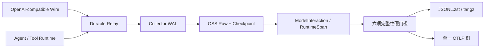

# 芯迹（ChipTrace）

<p align="center">
  <a href="https://github.com/XS-MLVP">
    
  </a>
</p>

<p align="center">
  <a href="https://github.com/XS-MLVP"><strong>万众一芯团队</strong></a>
  ·
  <a href="https://open-verify.cc/">官方网站</a>
</p>

面向芯片行业 Agent 的 Trace 采集与训练数据治理框架。ChipTrace 使用单一 Rust
二进制完成可靠采集、vendor-neutral 模型交互投影、任务 DAG 组装、版本化验收、
JSONL 分包和 OSS/S3 发布。

## 架构



Raw 是不可变事实源。`ModelInteraction` 以单次模型请求/响应为原子；Session 是后续
任务投影。模型调用、客户端回传结果和工具真实执行分别保存，通过精确 ID 关联。

## 核心能力

- Relay/Collector：本地 durable outbox、分片 WAL、redb ledger、幂等与崩溃恢复。
- Capture：成功、失败、取消、重试、生命周期、工具、评测和未知事件完整保存。
- Protocol：当前交付主路径为 OpenAI Responses 流式协议；`[DONE]` 只表示传输收尾，
  不表示模型完成。
- Runtime：lifecycle 生成唯一 Task Root，模型交互、工具结果和真实执行通过精确 ID 关联。
- Integrity：`artifact_valid`、`raw_bytes_complete`、`protocol_complete`、
  `runtime_complete`、`root_complete` 和 `delivery_ready` 六项结果不可互相补偿。
- Release：Session 原子分包、Manifest、SHA-256、JSONL.zst、tar.gz 和 OSS/S3 提交。
- OTLP：仅从 `delivery_ready=true` 的 canonical Trace 导出单根树，并验证全部内部父节点。

## 构建

要求 Rust 1.91+。

```bash
cargo build --release --locked
cargo test --workspace --all-targets --locked
cargo clippy --workspace --all-targets --locked -- -D warnings
target/release/chiptrace self-test
```

Linux 上安装 Docker Engine 与 Compose 插件后，使用唯一的隔离测试部署执行 M0 验收：

```bash
make m0-test
```

## 采集

启动 Collector：

```bash
target/release/chiptrace collector \
  --root /srv/chiptrace/capture \
  --state-root /var/lib/chiptrace/state \
  --host 127.0.0.1 --port 3010
```

单条使用 `POST /capture`，批量使用 `POST /captures`；批量请求为 NDJSON，每行一个
Capture：

```bash
curl --fail-with-body http://127.0.0.1:3010/captures \
  -H 'content-type: application/x-ndjson' \
  --data-binary @captures.jsonl
```

跨进程可靠投递使用 Relay：

```bash
target/release/chiptrace relay \
  --root /var/lib/chiptrace/outbox \
  --state-root /var/lib/chiptrace/outbox-state \
  --delivery-state-root /var/lib/chiptrace/delivery \
  --collector-url http://127.0.0.1:3010 \
  --host 127.0.0.1 --port 3011
```

Harness/dispatcher 将任务生命周期、真实工具 started/terminal 和 evaluator 事件提交到
`POST /producer/events`。生产接入、断线恢复、Codex bundle exporter 和 `codex-run`
命令见[部署与运维](docs/operations.md)。

## Canonical 投影

从已封存或已 Enrich 的 Capture 生成并验证通用模型交互：

```bash
target/release/chiptrace project-interactions \
  --input /srv/chiptrace/enriched \
  --task-session-id task-20260830-001 \
  --output /srv/chiptrace/interactions

target/release/chiptrace verify-interactions \
  --projection /srv/chiptrace/interactions
```

输出包含：

```text
interactions/
├── interactions/model-interactions.jsonl.zst
├── runtime/runtime-spans.jsonl.zst
├── links/interaction-links.jsonl.zst
└── manifest.json
```

生成并验证 OTLP 树：

```bash
target/release/chiptrace export-otlp \
  --projection /srv/chiptrace/interactions \
  --output /srv/chiptrace/otlp

target/release/chiptrace verify-otlp \
  --projection /srv/chiptrace/otlp
```

## 采购交付

生产流程先归档 Raw，再从完整 Checkpoint 恢复、关联、组装和分包：

```bash
target/release/chiptrace enrich \
  --input /srv/chiptrace/restored \
  --usage-log /srv/routing/usage.jsonl \
  --output /srv/chiptrace/enriched

target/release/chiptrace assemble \
  --input /srv/chiptrace/enriched \
  --output /srv/chiptrace/assembly

target/release/chiptrace release \
  --input /srv/chiptrace/assembly \
  --output /srv/chiptrace/release-v1 \
  --release-id release-v1 \
  --profile buyer-v7-codex-runtime-expanded \
  --minimum-score 90 \
  --target-part-gib 10

target/release/chiptrace verify-release \
  --release /srv/chiptrace/release-v1 --require-pass

target/release/chiptrace package-buyer \
  --release /srv/chiptrace/release-v1 \
  --output /srv/chiptrace/buyer-v1

target/release/chiptrace verify-buyer-package \
  --package /srv/chiptrace/buyer-v1
```

`buyer-v7-codex-runtime-expanded` 是当前严格采购 Profile。`buyer-v7` 仅作为旧命令行和
历史 Manifest 的读取别名。该 Profile 的 100 分表示 expanded Session 结构验收通过，
不表示 OpenAI wire 字节完整；两者分别报告。

## 文档

- [架构与性能](docs/architecture.md)
- [数据与评分契约](docs/data-contract.md)
- [JSONL 与对象存储交付](docs/delivery.md)
- [OSS 原始层与提交协议](docs/object-storage.md)
- [交付验收矩阵](docs/acceptance-matrix.md)
- [部署与运维](docs/operations.md)
- [OpenAPI](schemas/openapi.yaml)

## 许可证

本项目使用 [Apache License 2.0](LICENSE)。
