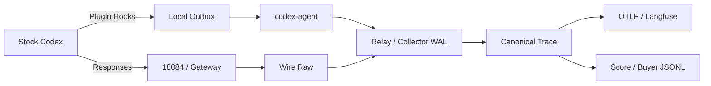

# 芯迹（ChipTrace）

<p align="center">
  <a href="https://github.com/XS-MLVP">
    
  </a>
</p>

<p align="center">
  <a href="https://github.com/XS-MLVP"><strong>万众一芯团队</strong></a>
  ·
  <a href="https://open-verify.cc/">官方网站</a>
</p>

面向芯片行业 Agent 的 Trace 采集与训练数据治理框架。ChipTrace 将 Stock Codex 的
OpenAI-compatible Wire 与本地 rollout 合并为可验证轨迹，并输出 Langfuse OTLP 和
采购方 JSONL。

## 功能



- 无损保存请求、响应、SSE、rollout 原始行及其 SHA-256。
- Hook 先原子写入本地 outbox，`codex-agent` 在 durable ACK 后推进队列。
- 精确关联 Session、Turn、模型调用、真实工具执行、子代理和 Token。
- 分离模型状态、上游传输状态和客户端交付状态。
- 生成 OpenInference OTLP 树、验收评分、Manifest、JSONL 和 `tar.gz` 分包；OTLP 正文仅
  保留 20 KiB 预览、原长度和 SHA-256，完整值留在 Canonical/Raw。

Langfuse 负责查询、展示和评测；ChipTrace 负责 Raw 事实、可靠投递与采购验收。

## 构建

要求 Rust 1.91+、Linux x86-64 或 aarch64。

```bash
cargo build --release --locked
cargo test --workspace --all-targets --locked
cargo clippy --workspace --all-targets --locked -- -D warnings
target/release/chiptrace self-test
```

仓库只保留一个隔离验收环境：

```bash
make m0-test
```

## 接入 Stock Codex

先将 `chiptrace` 安装到 Hook 和用户服务都能访问的位置：

```bash
install -Dm755 target/release/chiptrace "$HOME/.local/bin/chiptrace"
```

Codex 的 OpenAI provider `base_url` 指向承载 Wire 旁路采集的网关。安装仓库插件后，
用户仍直接运行普通 `codex`：

```bash
codex plugin marketplace add XS-MLVP/ChipTrace --ref main
codex plugin add chiptrace@xs-mlvp
```

插件只写本地 outbox，不访问网络。使用仓库提供的 systemd 用户服务持续投递：

```bash
install -Dm644 deploy/chiptrace-codex-agent.service \
  "$HOME/.config/systemd/user/chiptrace-codex-agent.service"
install -Dm600 deploy/codex-agent.env.example \
  "$HOME/.config/chiptrace/codex-agent.env"
```

在启动服务前配置 Relay URL、来源命名空间和不少于 32 字节的 Producer Token。Collector、
Relay、18084 入口及 canary 步骤见[部署与运维](docs/operations.md)。

```bash
systemctl --user daemon-reload
systemctl --user enable --now chiptrace-codex-agent.service
```

## 处理与交付

```bash
chiptrace project-interactions \
  --input /srv/chiptrace/raw \
  --output /srv/chiptrace/interactions
chiptrace verify-interactions --projection /srv/chiptrace/interactions

chiptrace export-otlp \
  --projection /srv/chiptrace/interactions \
  --output /srv/chiptrace/otlp
chiptrace verify-otlp --projection /srv/chiptrace/otlp

export LANGFUSE_PUBLIC_KEY='<public-key>'
export LANGFUSE_SECRET_KEY='<secret-key>'
export LANGFUSE_BASE_URL='<langfuse-base-url>'
chiptrace send-otlp \
  --projection /srv/chiptrace/otlp \
  --endpoint "$LANGFUSE_BASE_URL/api/public/otel/v1/traces"
```

`delivery_ready` 只表示 Raw、协议、Runtime 和根节点完整；`training_ready` 还要求闭合
Session 和真实训练交互；`buyer_eligible` 再叠加指定采购 Profile。三种口径独立统计，
Buyer 分数不能补偿任何完整性硬门槛。

JSONL 评分、10 GiB 级分包和对象存储发布见[数据交付](docs/delivery.md)。

## 文档

- [架构](docs/architecture.md)
- [部署与运维](docs/operations.md)
- [数据契约](docs/data-contract.md)
- [交付验收矩阵](docs/acceptance-matrix.md)
- [OpenAPI](schemas/openapi.yaml)

## 许可证

本项目使用 [Apache License 2.0](LICENSE)。
