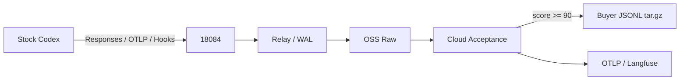

# 芯迹（ChipTrace）

<p align="center">
  <a href="https://github.com/XS-MLVP">
    
  </a>
</p>

<p align="center">
  <a href="https://github.com/XS-MLVP"><strong>万众一芯团队</strong></a>
  ·
  <a href="https://open-verify.cc/">官方网站</a>
</p>

面向芯片行业代码 Agent 的 Trace 采集与训练数据验收框架。ChipTrace 在云端保存 Stock
Codex 的 Responses Wire、原生 OTLP 和生命周期 Hook，组装完整 Session，并只交付通过
Buyer v7 硬门槛的 UTF-8 JSONL `tar.gz`。

## 主线



用户主机不运行 ChipTrace 程序。管理员下发 Stock Codex 原生
[配置与 required Hooks](integrations/codex/README.md)，用户继续直接运行 `codex`。
Wire、OTLP 和 Hook 使用 Stock Codex 自带的 Session、Turn、call ID 和 W3C Trace Context
精确关联；缺失或冲突时拒绝交付，不补造 Schema、状态、模型身份或任务边界。

## 构建

要求 Rust 1.91+。

```bash
cargo build --release --locked
cargo test --workspace --all-targets --locked
cargo clippy --workspace --all-targets --locked -- -D warnings
make m0-test
```

## 验收

`cloud-acceptance` 是唯一采购验收入口。它从已提交 Raw Archive 开始，依次复验原始对象、
Sub2API 精确路由、Canonical Schema、OTLP 树、Session、Buyer v7、Release 和采购包；任一
步骤失败即返回非零状态。

```bash
chiptrace cloud-acceptance \
  --archive-id raw-20260902-01 \
  --backend oss \
  --endpoint https://oss-cn-hangzhou.aliyuncs.com \
  --bucket trace-dataset \
  --prefix chiptrace \
  --usage-log /srv/sub2api/usage.jsonl \
  --session-id <stock-codex-session-id> \
  --release-id release-20260902-01 \
  --output /srv/chiptrace/acceptance/release-20260902-01
```

通过结果必须同时满足：`delivery_ready=true`、有效轮次不少于 10、不同工具不少于 5、
完整工具定义不少于 5、去尾配对率 100%、Buyer v7 分数不低于 90、全部 hard gate 通过、
OTLP 单根且内部父引用全部可解析。

## 文档

- [架构](docs/architecture.md)
- [部署与运维](docs/operations.md)
- [数据契约](docs/data-contract.md)
- [验收矩阵](docs/acceptance-matrix.md)
- [交付格式](docs/delivery.md)
- [OpenAPI](schemas/openapi.yaml)

## 许可证

本项目使用 [Apache License 2.0](LICENSE)。
