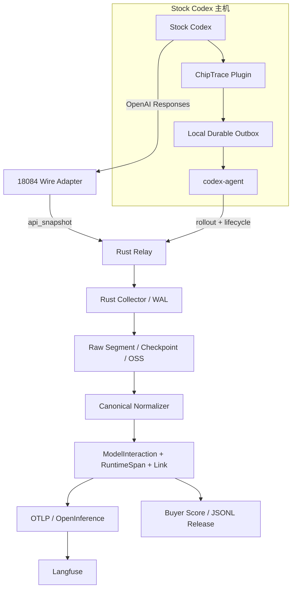

# 架构

## 目标

ChipTrace 只解决四件事：无损保存模型 Wire 与 Codex rollout、可靠投递、生成标准 OTLP、
输出可验证的采购数据。查询、回放、人工评分和 LLM Judge 交给 Langfuse，不在本项目重复
建设。

## 单一主链



Stock Codex 不需要补丁、启动器或自定义任务标签。插件 Hook 只做同步本地落盘，网络重试由
独立 `codex-agent` 承担，避免采集故障阻塞用户交互。

## 事实层

ChipTrace 不从下游投影反推或补造上游事实：

| 事实 | 权威来源 | 用途 |
| --- | --- | --- |
| 请求、响应、SSE、HTTP 状态 | 18084 Wire | 模型输入输出、工具定义、usage、协议终态 |
| Session/Turn 与消息事件 | Stock Codex rollout | 会话边界、系统提示词、压缩、子代理 |
| 工具真实执行 | rollout `item_completed` | 参数、结果、错误、取消、耗时 |
| Hook 生命周期 | Codex Plugin | Session start/end、Stop、Interrupt、子代理事件 |
| Raw lineage | Relay/Collector | 原始字节、长度、SHA-256、attempt、checkpoint |

Canonical 以单次模型交互为原子：

```text
Trace
├── ModelInteraction[]
├── RuntimeSpan[]
├── InteractionLink[]
└── raw_capture_refs[]
```

`model_tool_call`、`tool_result_submitted` 和 `runtime_tool_execution` 分别保存。外层 Code
Mode `exec` 与内层命令执行同时保留，不互相替换。

## 身份与关联

身份使用源字段，不从 thread ID 猜任务边界：

- `session_meta.session_id` 映射为 `session.id`。
- `session_meta.id` 映射为 `thread_id`。
- 根线程的 `root_turn_id` 是 OTLP Trace 边界。
- `parent_thread_id` 与 `agent_path` 组成子代理 DAG。
- `request_id`、`response_id`、`previous_response_id` 和 `call_id` 只做精确关联。

Code Mode 内层执行只在同一 Turn 恰有一个未闭合外层调用时挂到该调用。存在多个候选时，
执行挂到 Turn 根并标记 warning，不选择一个“最像”的父节点。

工具 schema 优先来自 Wire 中模型实际收到的 `tools`/`additional_tools`。rollout 未携带
schema 时保持 `source_complete=false`；只有调用名能与完整真实定义精确匹配时，Buyer
工具定义门槛才通过。Runtime Registry 不是生产依赖，也不能用静态模板补 schema。

## 状态模型

流式响应分别记录：

```text
model_status
upstream_transport_status
client_delivery_status
```

`[DONE]` 只表示 SSE framing 结束。模型 completed 与客户端 cancelled 可以同时成立；
SSE error、EOF 无终态和传输错误不会被改写为 completed。

制品采用六项硬门槛：

```text
artifact_valid
raw_bytes_complete
protocol_complete
runtime_complete
root_complete
delivery_ready
```

Buyer 分数是独立结果。`score >= 90` 仍需全部采购 hard gate 通过。

## 可靠投递

1. Hook 在用户主机写临时文件、`fsync`，再原子发布到 `pending/`。
2. `codex-agent` 读取 Hook 指向的 rollout 完整行，保留原文与 SHA-256。
3. Producer 使用确定性 Capture ID，断线至少重试 20 次。
4. Relay 本地 WAL durable ACK 后，Agent 才删除 pending Hook。
5. Relay 异步续投 Collector；相同 ID/相同字节幂等，相同 ID/不同字节冲突。
6. Collector 封存 Segment 后写 Manifest 和 Checkpoint，再发布到 OSS/S3。

认证只作用于 `/producer/event(s)`；OpenAI Wire Capture 路径保持与网关内部集成一致。正文
校验失败返回 400 并隔离，只有网络或下游暂时故障返回可重试的 5xx。

## OTLP 与 Langfuse

OTLP 投影读取 Canonical 与 `InteractionLink`，输出：

- `openinference.span.kind=AGENT|LLM|TOOL`
- 每个 Span 的 `session.id`
- `gen_ai.*` 模型、Token 和响应字段
- 工具名称、ID、参数、结果和真实 schema
- 每个 Turn 一个根，内部父引用解析率 100%

Langfuse 接收裁剪后的标准 OTLP。完整正文和大对象留在 Raw，只通过 hash 与引用回查。

## 性能边界

在线路径使用有界 Body、队列、批次和在途字节预算。Relay 与 Collector 分开确认，按
`SHA-256(captureId) % shards` 固定分片；离线投影、压缩和 OSS 发布不占业务请求时延。
吞吐测试必须分别报告业务 Wire、WAL durable ACK、压缩与对象上传，不把内存处理速度
写成端到端吞吐。
