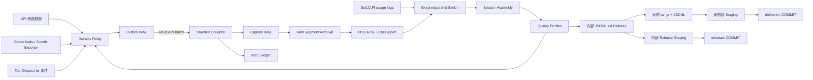
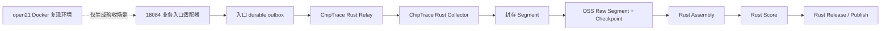

# 架构与性能

## 数据流



一个 `captureId` 表示一条不可变采集事件。`api_snapshot` 保存真实 API
请求/响应；`lifecycle_event`、`tool_execution` 和 `evaluation` 由 Agent 或
工具执行器产生；`rollout_event` 保存 Codex 原始事件及投影。Codex 0.150+
优先从原生 `codex-rollout-trace` bundle 导出；普通 rollout JSONL 仅作为兼容入口。
`task_session_id`
标识完整任务，`thread_id` 和 `turn_id`
只表示产品线程与节点。在线阶段不做质量筛选，Session 投影与去重在离线执行。

## 唯一生产架构

ChipTrace 的生产 Trace 数据平面只有一套 Rust 实现：



18084 是既有业务入口，只负责受限旁路复制和向入口 outbox 投递；outbox 在响应
完成后原子落盘并异步向 Rust Relay 重试。它不执行 Trace 语义组装。`open21` 的
Compose 网络与 `router-v2-net` 隔离，属于
Docker 复现/验收环境，不写入生产 Trace 存储。

`collector`、`relay`、`assemble`、`score`、`release` 和 `publish` 均由同一个
`chiptrace` Rust 二进制提供。Relay 独立启动；Collector 暂停或冷启动失败时，
Capture 仍先进入 durable outbox，并在 Collector 恢复后自动续投。

对象存储适合不可变文件，不适合为每次请求提供低延迟追加确认。ChipTrace 先在
本地 WAL 完成 durable ACK，再把已封存的原始 Segment 通过统一对象存储适配层
发布到 OSS/S3。多个 Segment 组成一条逻辑连续日志，Manifest 描述文件集合，
最后写入 Checkpoint 作为可见提交点。这样 Collector 暂停、对象存储限流或网络
中断不会改变 Agent 的业务响应，也不会丢失已经由 Relay 接收的 Capture。

## 在线采集

Collector 提供两个等价入口：

- `POST /capture`：单条 JSON，便于直接集成。
- `POST /captures`：NDJSON 批次，摊薄 HTTP、事务和 fsync 成本。

本机 Relay 另提供 `POST /producer/event` 和 `POST /producer/events`。Harness/
dispatcher 提交尚未分配 Capture ID 的版本化事件，Relay 完成契约校验、确定性 ID、
本地 outbox 持久化和幂等 ACK；在线生产者不需要先维护第二份 JSONL 队列。

入口统一接收五类 Capture：

| 类型 | 生产者 | 保存内容 |
| --- | --- | --- |
| `api_snapshot` | 业务入口旁路 | 原始请求、SSE/响应、HTTP 状态、usage |
| `lifecycle_event` | Agent harness | task start/end/cancel/retry、compaction、subagent 事件 |
| `tool_execution` | 工具执行器 | 调用身份、真实参数、完整 schema、结果与状态 |
| `evaluation` | 测试/evaluator | 构建、测试、搜索和最终验收证据 |
| `rollout_event` | Codex exporter | 源 JSONL、消息、turn、Token、compaction、subagent 和未知事件 |

`lifecycle_event`、`tool_execution` 和 `evaluation` 必须携带与 API snapshot 一致的 `sourceNamespace` 和
`traceContext.task_session_id`。`tool_execution` 还必须提供 `initiator`；只有真实的
`assistant` 发起执行会投影为训练消息，runtime/user 动作保留为审计 span。来源
没有明确状态时保存为 unknown，不推断为成功。

Harness 和 dispatcher 使用 Relay producer 入口提交事件；`chiptrace produce` 用于
文件补投。契约要求 `stream_id + sequence`、真实证据时间、显式工具状态和完整
Schema。Assembly 校验 producer stream 连续性，并将同一 call ID 的 started/terminal
归并成一个 span；缺失、重复或字段漂移会使严格验收失败。任务开始事件可携带实际
`toolRegistry` 快照；Assembly 保存其内容 hash、生产者版本和工具数量。

请求先占用全局在途字节预算，再读取 Body。带 `Content-Length` 的请求在读取
前预留完整容量；流式请求逐帧预留。连接数、在途字节、队列项、批次记录数和
批次字节均为有界资源。

Store 使用稳定的 `SHA-256(captureId) % shards` 路由。分片拓扑写入
`sharding.json`，重启时禁止静默改变；生产环境可将每个 `shard-*` 目录挂载到
独立 NVMe。每个分片只有一个 WAL 写者，并按以下顺序确认：

1. 规范化 Capture，移除认证头。
2. 批量追加完整 NDJSON 行并更新增量 SHA-256。
3. 执行 `fdatasync`。
4. 在一个 redb 事务中提交 locator、attempt 和增量计数。
5. redb durable commit 完成后返回 ACK。

进程在第 3、4 步之间退出时，启动恢复会扫描 open WAL、截断不完整尾行并补写
`recovered` attempt。相同 captureId 和相同规范化字节返回幂等成功；相同 ID
对应不同字节返回冲突。健康接口读取持久化增量计数，不随历史记录数增长而
全表扫描。

Relay 先完成本地 WAL 确认，再异步投递。delivery ledger 使用独立的到期时间
索引；重启后 `inflight` 回到 `pending`。Worker 将多个 Capture 合并为 NDJSON
请求，Collector 不支持批量入口时自动回退到单条投递。

18084 到入口 outbox 的提交发生在业务响应结束之后；文件 `fsync` 和原子 rename
完成后即获得本地 durable 交接。outbox 向 Rust Relay 使用有界异步重试（生产为
25 次尝试、24 次重连），采用指数退避、5 秒上限和抖动；它不等待采集结果再返回
业务响应。只有 Rust Relay 返回 `durable=true` 后，Capture 才从入口 outbox 删除。
入口进程重启会恢复 `processing/` 文件，远端幂等由同一 `captureId` 保证。

投递 Payload 使用跨全部 Worker 的全局字节预算，避免大响应与高并发叠加造成
内存失控。每次 claim 同时写入持久化 lease；进程异常、任务取消或网络请求
卡死后，过期 `inflight` 会返回 `pending`，并沿用同一 `captureId` 幂等续投。

Native bundle exporter 以 `trace.jsonl` canonical path 为 checkpoint key，持久化
manifest hash、配置指纹、byte offset、连续 seq、最后一行 SHA-256 及工具/模型
关联上下文；先镜像 event/payload 原始字节，再在 durable ACK 后提交 checkpoint。

`chiptrace codex-run` 是原生生产者的任务监督入口。它在启动 Codex 前创建 Harness
身份和 W3C `traceparent`，把同一组 `x-chiptrace-*` 关联头注入模型请求，并在进程运行
期间持续导出 bundle。`single` 在一个进程内创建并关闭任务；`begin`、`continue`、
`finish` 允许同一显式任务跨多个 rollout，始终复用一个 Harness state，并为每个阶段
使用独占 bundle 目录。Assembly 将这些 rollout 根组装为
`runtime_dag.root_mode=task_scoped_rollout_forest`，不会把任一 rollout 结束误当成任务结束。

兼容 Codex exporter 以源文件 canonical path 为 checkpoint key，持久化 byte offset、
ordinal、最后一行 SHA-256 和解析上下文。Capture ID 由源 Session 与 ordinal
确定；Relay 在 checkpoint 落后于投递时通过相同 ID 幂等去重。未换行的活动尾部
不会提交，下次继续读取；源文件在 checkpoint 前被截断或改写会直接失败。

原生 bundle 中的 `rollout_ended/thread_ended` 是运行时生命周期，只投影为
`rollout_end/thread_end`，不证明完整任务边界。rollout JSONL 中的
`task_started/task_complete` 同样是 Codex turn 生命周期，只投影为
`turn_start/turn_end`，不证明完整任务边界。完整任务的 `task_session_id` 和
task start/end/cancel 必须由 harness 显式发送。Stop hook 用于结束时补采，常驻
sidecar 或 dispatcher 插桩负责崩溃前实时落盘；两者都投递同一 Rust Relay。

模型原生 `custom_tool_call/function_call` 保存为 Assistant 调用，输出缺少显式状态时
保持 `unknown`。`CommandExecution`、`FileChange` 等 runtime item 保存真实参数和
状态；只有 CLI 版本、Registry Schema 名和模型调用 `call_id` 同时一致，runtime
状态才关联回 Assistant 调用。缺少 Registry 时真实执行仍保存，Schema 明确为 null，
并进入 `rollout_unmapped_tools`；不得解析 `source_js` 补造 Schema。Code Mode 内层 ID
与外层调用不一致时同样拒绝进入严格 Release。`WebSearch` 调用可识别，但 rollout
未保存搜索结果正文时不能生成有效 Tool Result。未知 rollout 类型保留原文并标记
incomplete。Codex `agent_name/agent_path` 与 harness 的稳定 `agent_id` 分字段保存。

## 轨迹组装

身份优先级为：

```text
task_session_id
task_id
session_id
conversation_id
trace_id
turn_id
thread_id
prompt_cache_key
captureId fallback
```

`task_session_id` 由 Agent harness 在任务开始时创建，并贯穿 API、工具、子代理
和 evaluator 事件。缺失时保留旧的身份回退链，但不能据此证明任务边界完整。
`sourceNamespace` 参与分区键，避免不同来源的同名 Session 碰撞。
若 API snapshot 或 runtime Capture 只有一侧携带任务身份，Assembly 仅在同一
`sourceNamespace` 内通过 upstream/client/response/gateway request ID 做两遍精确
关联；一对多冲突立即失败，不使用时间、模型或 thread ID 回退。

Assembly 先按 root Session 哈希分区，再并行组装：

- `meta.capture_dag` 保存 response 节点、父边、根、尾、环、缺失父节点以及
  `executed`、`retry`、`abandoned`、`open_tail`。
- `meta.task_dag` 连接 root 与 subagent，子轨迹保留独立身份并可拆分。
- 工具定义保存参数 Schema、SHA-256 和版本；每个调用保存真实配对结果与
  `executed`、`failed`、`unknown`、`open_tail` 或 `unpaired` 状态。
- 每条 Capture 的 trace context 原样进入 `meta.trace_contexts`；Session 级
  标识同时投影到 `meta.trace`，避免只保留一个 Codex thread 标识。
- 生命周期事件的 type、status、reason、occurred_at 和 capture_id 原样进入
  `meta.lifecycle_event_records`；测试、构建、搜索、用户修正、最终验收和
  evaluator 证据原样进入 `meta.evaluation_evidence`。
- API、原生 inference 和 Sub2API usage 按精确 ID 组成调用组件，每个组件只结算
  一次 Token；选择依据写入 `meta.usage_settlement_evidence`，组件内冲突触发硬门槛。
- `meta.inference_api_conservation` 独立核对每个原生 `inference_completed` 与 18084
  `api_snapshot`。只接受精确 `upstream_request_id` 或 `response_id`；缺 ID、漏采、
  重复 runtime key 或无法覆盖都会使 `inference_api_conservation` hard gate 失败。
- dispatcher `tool_call_ended` 与延后到达的 runtime terminal 状态分别保留。Codex 的
  dispatcher `completed` 仅表示包装调用结束，工具结果以 runtime terminal 为准；若
  dispatcher 明确声称 success/error/cancelled 且与 runtime 矛盾，则写入
  `runtime_dag.status_conflict_node_ids`，Runtime DAG 标记为不完整。

累计请求快照按 message ID、call ID 和 response DAG 合并；`turn_id`、span ID
与 `previous_response_id` 保存在节点级，不作为 Session 冲突。单次模型 response
的 `completed` 不等于任务完成。只有 `task_end`、`session_end`、cancel、
terminate 等显式事件关闭 Session。真实消息分歧、Schema 冲突、Trace 冲突、
同一权威 System Prompt 投影跨快照冲突、DAG 环和缺失父节点触发
`assembly_integrity` hard gate。API/网关 usage 冲突、未知 rollout 事件和未映射
runtime tool 也进入该 Gate。request/developer/response 属于不同 Prompt 层，
文本不同只保留来源证据，不直接判为冲突。
没有消息 ID 时按相同内容的出现序号合并累计快照，真实的重复追问不会被折叠。

推理/API 守恒和 Token 去重是两项独立证明：前者证明生产者看见的模型调用没有在
18084 旁路丢失，后者证明同一调用不会因 API、rollout、Sub2API 三份证据重复计费。
原生 runtime 存在但 Assembly 缺少守恒对象时按失败处理，旧产物不能以缺字段绕过 Gate。

## 原始 OSS 归档

`chiptrace archive-raw` 只读取 `.sealed.ndjson`；目录中发现非空的正在写入
`.open.ndjson` 会直接失败，避免把活动尾段静默排除后仍声称 `complete`。`/flush`
产生的零字节 open 占位文件会被忽略。需要归档当前窗口时先调用 `/flush`，或显式
传入已经封存的文件集合。Segment 使用内容寻址对象键 `raw/objects/<sha256>.ndjson`，同一份原始字节在
不同归档批次中只需上传一次。每个归档包含 `manifest.json` 和最后写入的
`CHECKPOINT.json`；Checkpoint 出现前，任何对象都不构成可消费快照。

默认要求每个 shard 从 Segment 1 开始且序号连续，Manifest 的 `completeness` 为
`complete`。`--allow-segment-gaps` 只生成 `partial` 取证快照，Release 不得使用。
归档、校验和恢复命令以及字段契约见 [OSS 原始层与提交协议](object-storage.md)。

## 制品对象提交

OSS/S3 不提供跨对象事务。Publish 使用 manifest-last 协议：

1. 验证本地内部 Release 或采购包、文件集合、记录数和 SHA-256。
2. 上传到 `.staging/<namespace>/<release_id>/<manifest_sha256>/`。
3. 并行 multipart 上传并回读校验对象长度与 SHA-256。
4. 内部 Release 最后写入 `releases/<release_id>/COMMIT.json`；采购包最后写入
   `deliveries/<release_id>/COMMIT.json`。
5. 消费端只读取 COMMIT 引用的对象。

两个命名空间共用同一 OpenDAL 上传、重试、校验与提交实现。相同命名空间、
release_id 和 Manifest 重试为幂等成功；不同 Manifest 为冲突。`verify-published`
不依赖 LIST，只读回验 COMMIT 引用的完整对象集合。

## 市场方案对照

主流产品采用“SDK/网关采集 → span/event 存储 → 评测与数据集投影”的分层，
但侧重点不同：

| 方案 | 强项 | 对训练数据供应的边界 |
| --- | --- | --- |
| [OpenTelemetry](https://github.com/open-telemetry/opentelemetry-collector) + [OpenInference](https://github.com/Arize-ai/openinference) | 通用传输、GenAI/Tool/Agent span 语义与生态 | 不定义采购 Session、硬门槛、去重和 10 GiB 原子分包 |
| [Langfuse](https://github.com/langfuse/langfuse) / [Phoenix](https://github.com/Arize-ai/phoenix) | Trace 查询、展示、评分和评测 | 作为可选 OTLP 投影；默认截断/fail-open 语义不能替代权威 Raw |
| LangSmith / Braintrust / W&B Weave / MLflow Tracing | 框架插桩、实验、反馈和 evaluator | 以应用观测/评测为中心，不保证网关旁路的 durable ACK 和 Session 原子 Release |
| [Helicone](https://github.com/Helicone/helicone) | 代理网关低侵入采集请求与响应 | 仅靠代理无法观察任务结束、内部工具状态和子代理 join |
| ChipTrace | durable 原始证据、任务事件、采购评分和对象交付 | 需要业务入口与 Agent harness 同时接入，不能从 HTTP 快照臆造缺失事件 |

ChipTrace 沿用 OpenTelemetry 的 trace/span/parent 关系和 OpenInference 的
Agent/Tool 语义边界，但在线格式保持可直接 durable append 的 JSON/NDJSON。
OTLP 适配属于接入层，canonical Session 和 buyer profile 不依赖特定后端。
网关路由与 Token 事实参考 Sub2API 的 append-only `usage_logs`，但只通过明确
`request_id` 离线 Join；网关账单日志不替代 Agent lifecycle/tool span。
Codex rollout 解析参考观测插件的确定性 Trace 思路，但原始事件、checkpoint、
unknown 处理和采购 Gate 由 ChipTrace 自己保证。

## 设计依据

| 参考项目 | 借鉴点 | ChipTrace 实现 |
| --- | --- | --- |
| [OpenTelemetry Collector](https://github.com/open-telemetry/opentelemetry-collector) | Receiver、Processor、Exporter 分层和背压 | Relay、Collector、Assembly、Quality、Publish |
| [Vector](https://github.com/vectordotdev/vector) | 磁盘缓冲、端到端 ACK、批量发送 | WAL outbox、delivery ledger、NDJSON batch |
| [OpenInference](https://github.com/Arize-ai/openinference) | LLM、Tool、Agent 语义字段 | canonical Session 与 Trace hierarchy |
| [Apache Iceberg](https://github.com/apache/iceberg) | 不可变数据文件与元数据提交 | staging objects + COMMIT.json |
| [Apache OpenDAL](https://github.com/apache/opendal) | 统一对象存储 API | Rust 依赖接入 OSS、S3 和本地后端 |

项目没有复制这些仓库的源文件；OpenDAL 通过 Cargo 依赖使用，其余项目作为
组件边界和数据契约参考。

## 性能基线

2026-08-27 至 2026-08-29，本机 AMD Ryzen 9 5950X、32 线程、125 GiB 内存、本地 ext4，
Rust release 构建。Collector 单层和 Relay -> Collector 双层分别计量：

| 路径 | 样本 | 分片 | fsync | 吞吐 |
| --- | --- | ---: | --- | ---: |
| Store durable ACK | 64 KiB | 1 | 开启 | 241 MiB/s |
| Store durable ACK | 64 KiB | 4 | 开启 | 325 MiB/s |
| Store durable ACK | 256 KiB | 4 | 开启 | 382 MiB/s |
| HTTP + Store durable ACK | 64 KiB | 4 | 开启 | 338 MiB/s |
| HTTP + Store durable ACK | 256 KiB | 4 | 开启 | 358 MiB/s |
| HTTP 工程上限 | 256 KiB | 4 | 关闭 | 1,460 MiB/s |
| Relay -> Collector API 端到端 | 256 KiB | 4 + 4 | 双层开启 | 172 MiB/s |
| Relay producer -> Collector 端到端 | 256 KiB | 4 + 4 | 双层开启 | 163 MiB/s |
| Relay producer 工程上限 | 256 KiB | 4 + 4 | 双层关闭 | 560 MiB/s |
| JSONL zstd 输入 | 64 KiB | 16 流 | 输出 fsync | 548 MiB/s |
| JSONL zstd 输出 | 64 KiB | 16 流 | 输出 fsync | 418 MiB/s |
| JSONL zstd 输入 | 256 KiB | 16 流 | 输出 fsync | 557 MiB/s |
| JSONL zstd 输出 | 256 KiB | 16 流 | 输出 fsync | 424 MiB/s |

64 KiB HTTP 批次的 p50/p95/p99 为 177/207/211 ms；256 KiB 批次为
172/212/254 ms。`--no-fsync` 仅用于定位 CPU/内存上限，不能作为可靠采集
配置或交付指标。

复现命令：

```bash
chiptrace benchmark-store \
  --records 5000 --payload-kib 256 --concurrency 256 --store-shards 4

chiptrace benchmark-http \
  --records 5000 --payload-kib 256 --batch-records 16 \
  --concurrency 16 --store-shards 4

chiptrace benchmark-http \
  --records 1024 --payload-kib 256 --batch-records 16 \
  --concurrency 16 --store-shards 4 --relay --producer-events

chiptrace benchmark-compression \
  --records 10000 --payload-kib 64 --level 1 \
  --streams 16 --workers-per-stream 1
```

压缩样本为确定性高熵文本，压缩比 1.31。Release 在全局去重后按内容指纹并行
评分、Token 化和压缩，相同指纹始终落到同一 worker，因此跨 Session 精确去重
不会因并行化失效。

500 MiB/s–1 GiB/s 是端到端生产验收目标，不是当前单机共盘双 WAL 可靠基线。
关闭 fsync 后 producer 双层链路达到 560 MiB/s，证明 CPU/解析路径达到目标下限；
可靠模式的 163 MiB/s 表明当前瓶颈是共盘双 fsync。达到生产目标需要 Relay 与
Collector 使用独立 NVMe 分片或多个节点、25GbE、足够 CPU，并分别压测 durable
ACK、Assembly、zstd、multipart 和 OSS 限流。最终报告必须同时给出吞吐、
p50/p95/p99、CPU、RSS、磁盘、网络和错误率。
