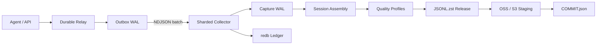
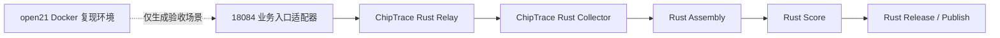

# 架构与性能

## 数据流



一个 `captureId` 表示一次真实 API 请求快照，一个 `session_id` 表示一次完整
任务。在线阶段保存全部成功、失败、取消和重试证据；Session 边界、去重和
质量筛选只在离线阶段执行。

## 唯一生产架构

ChipTrace 的生产 Trace 数据平面只有一套 Rust 实现：



18084 是既有业务入口，只负责受限旁路复制和向 Rust Relay 投递；它不执行
Trace 落盘或语义组装。`open21` 的 Compose 网络与 `router-v2-net` 隔离，属于
Docker 复现/验收环境，不写入生产 Trace 存储。

`collector`、`relay`、`assemble`、`score`、`release` 和 `publish` 均由同一个
`chiptrace` Rust 二进制提供。Relay 独立启动；Collector 暂停或冷启动失败时，
Capture 仍先进入 durable outbox，并在 Collector 恢复后自动续投。

对象存储适合不可变大对象，不适合为每次请求提供低延迟追加确认。ChipTrace
先在本地 WAL 完成 durable ACK，再将 Session JSONL 分片发布到 OSS/S3。这样
Collector 暂停、对象存储限流或网络中断不会改变 Agent 的业务响应，也不会
丢失已经由 Relay 接收的 Capture。

## 在线采集

Collector 提供两个等价入口：

- `POST /capture`：单条 JSON，便于直接集成。
- `POST /captures`：NDJSON 批次，摊薄 HTTP、事务和 fsync 成本。

请求先占用全局在途字节预算，再读取 Body。带 `Content-Length` 的请求在读取
前预留完整容量；流式请求逐帧预留。连接数、在途字节、队列项、批次记录数和
批次字节均为有界资源。

Store 使用稳定的 `SHA-256(captureId) % shards` 路由。分片拓扑写入
`sharding.json`，重启时禁止静默改变；生产环境可将每个 `shard-*` 目录挂载到
独立 NVMe。每个分片只有一个 WAL 写者，并按以下顺序确认：

1. 规范化 Capture，移除认证头。
2. 批量追加完整 NDJSON 行并更新增量 SHA-256。
3. 执行 `fdatasync`。
4. 在一个 redb 事务中提交 locator、attempt 和增量计数。
5. redb durable commit 完成后返回 ACK。

进程在第 3、4 步之间退出时，启动恢复会扫描 open WAL、截断不完整尾行并补写
`recovered` attempt。相同 captureId 和相同规范化字节返回幂等成功；相同 ID
对应不同字节返回冲突。健康接口读取持久化增量计数，不随历史记录数增长而
全表扫描。

Relay 先完成本地 WAL 确认，再异步投递。delivery ledger 使用独立的到期时间
索引；重启后 `inflight` 回到 `pending`。Worker 将多个 Capture 合并为 NDJSON
请求，Collector 不支持批量入口时自动回退到单条投递。

18084 到 Relay 的旁路提交使用有界异步重试（生产为 25 次尝试、24 次重连），
采用指数退避、5 秒上限和抖动；它不等待采集结果再返回业务响应。只有 Relay
返回 `durable=true` 后，Capture 才进入可恢复的本地 outbox。

投递 Payload 使用跨全部 Worker 的全局字节预算，避免大响应与高并发叠加造成
内存失控。每次 claim 同时写入持久化 lease；进程异常、任务取消或网络请求
卡死后，过期 `inflight` 会返回 `pending`，并沿用同一 `captureId` 幂等续投。

## 轨迹组装

身份优先级为：

```text
session_id
conversation_id
trace_id
task_id
thread_id
prompt_cache_key
captureId fallback
```

`session_id` 优先于 `thread_id`，因此一个 Codex thread 中的多个任务 Session
不会被强制合并。`sourceNamespace` 参与分区键，避免不同来源的同名 Session
碰撞。

Assembly 先按 root Session 哈希分区，再并行组装：

- `meta.capture_dag` 保存 response 节点、父边、根、尾、环、缺失父节点以及
  `executed`、`retry`、`abandoned`、`open_tail`。
- `meta.task_dag` 连接 root 与 subagent，子轨迹保留独立身份并可拆分。
- 工具定义保存参数 Schema、SHA-256 和版本；每个调用保存真实配对结果与
  `executed`、`failed`、`open_tail` 或 `unpaired` 状态。
- 测试、构建、搜索、用户修正、最终验收和 evaluator 证据原样进入
  `meta.evaluation_evidence`。

单次模型 response 的 `completed` 不等于任务完成。只有
`isFinalSnapshot`、`session_end`、cancel、terminate 等显式生命周期证据才
关闭 Session。消息分歧、Schema 冲突、Trace 冲突、DAG 环和缺失父节点均触发
`assembly_integrity` hard gate。

## 对象提交

OSS/S3 不提供跨对象事务。Publish 使用 manifest-last 协议：

1. 验证本地 Release、文件集合、记录数和 SHA-256。
2. 上传到 `.staging/<release_id>/<manifest_sha256>/`。
3. 并行 multipart 上传并校验对象长度，可选回读 SHA-256。
4. 最后写入 `releases/<release_id>/COMMIT.json`。
5. 消费端只读取 COMMIT 引用的对象。

相同 release_id 与相同 Manifest 重试为幂等成功；不同 Manifest 为冲突。

## 设计依据

| 参考项目 | 借鉴点 | ChipTrace 实现 |
| --- | --- | --- |
| [OpenTelemetry Collector](https://github.com/open-telemetry/opentelemetry-collector) | Receiver、Processor、Exporter 分层和背压 | Relay、Collector、Assembly、Quality、Publish |
| [Vector](https://github.com/vectordotdev/vector) | 磁盘缓冲、端到端 ACK、批量发送 | WAL outbox、delivery ledger、NDJSON batch |
| [OpenInference](https://github.com/Arize-ai/openinference) | LLM、Tool、Agent 语义字段 | canonical Session 与 Trace hierarchy |
| [Apache Iceberg](https://github.com/apache/iceberg) | 不可变数据文件与元数据提交 | staging objects + COMMIT.json |
| [Apache OpenDAL](https://github.com/apache/opendal) | 统一对象存储 API | Rust 依赖接入 OSS、S3 和本地后端 |

项目没有复制这些仓库的源文件；OpenDAL 通过 Cargo 依赖使用，其余项目作为
组件边界和数据契约参考。

## 性能基线

2026-08-27，本机 AMD Ryzen 9 5950X、32 线程、125 GiB 内存、本地 ext4，
Rust release 构建。结果均为 5,000 条、256 并发或 16 个 HTTP 批次并发：

| 路径 | 样本 | 分片 | fsync | 吞吐 |
| --- | --- | ---: | --- | ---: |
| Store durable ACK | 64 KiB | 1 | 开启 | 241 MiB/s |
| Store durable ACK | 64 KiB | 4 | 开启 | 325 MiB/s |
| Store durable ACK | 256 KiB | 4 | 开启 | 382 MiB/s |
| HTTP + Store durable ACK | 64 KiB | 4 | 开启 | 338 MiB/s |
| HTTP + Store durable ACK | 256 KiB | 4 | 开启 | 358 MiB/s |
| HTTP 工程上限 | 256 KiB | 4 | 关闭 | 1,460 MiB/s |
| JSONL zstd 输入 | 64 KiB | 16 流 | 输出 fsync | 548 MiB/s |
| JSONL zstd 输出 | 64 KiB | 16 流 | 输出 fsync | 418 MiB/s |

64 KiB HTTP 批次的 p50/p95/p99 为 177/207/211 ms；256 KiB 批次为
172/212/254 ms。`--no-fsync` 仅用于定位 CPU/内存上限，不能作为可靠采集
配置或交付指标。

复现命令：

```bash
chiptrace benchmark-store \
  --records 5000 --payload-kib 256 --concurrency 256 --store-shards 4

chiptrace benchmark-http \
  --records 5000 --payload-kib 256 --batch-records 16 \
  --concurrency 16 --store-shards 4

chiptrace benchmark-compression \
  --records 10000 --payload-kib 64 --level 1 \
  --streams 16 --workers-per-stream 1
```

压缩样本为确定性高熵文本，压缩比 1.31。Release 在全局去重后按内容指纹并行
评分、Token 化和压缩，相同指纹始终落到同一 worker，因此跨 Session 精确去重
不会因并行化失效。

500 MiB/s–1 GiB/s 是端到端生产验收目标，不是当前单机可靠基线。达到该目标
需要独立 NVMe 分片或多个 Collector、25GbE、足够 CPU，并分别压测 durable
ACK、Assembly、zstd、multipart 和 OSS 限流。最终报告必须同时给出吞吐、
p50/p95/p99、CPU、RSS、磁盘、网络和错误率。
