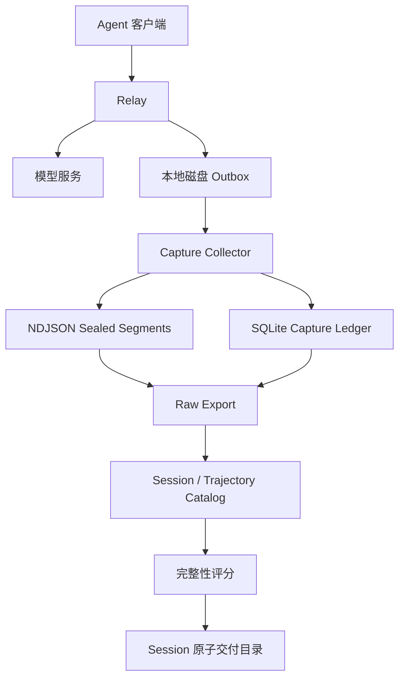

# 芯迹架构与性能

## 设计目标

本系统为 Agent 交互建立可审计的数据链路，覆盖在线采集、原始证据持久化、Session 组装、轨迹评分和标准交付。各阶段通过稳定标识、哈希和守恒校验连接。

系统遵循以下原则：

- 原始数据只追加，不在采集入口执行质量过滤。
- 转发链路与采集链路隔离，采集故障不改变上游响应。
- 每个 `captureId` 全局幂等，相同 ID 对应不同字节时显式冲突。
- Session、Turn、工具调用和父子关系只采用已观测标识。
- 完整性评分与语义奖励分离。
- 发布文件通过临时构建、完整校验和原子替换生成。

## 组件关系



直连入口与采集入口保持独立。选择采集入口的流量进入 Relay 旁路复制，直连入口不受 Collector 的部署、维护和背压策略影响。

## 在线采集

### Relay

Relay 从真实请求和响应中构造 capture envelope，并显式采集以下标识：

- `session_id`
- `thread_id`
- `root_session_id`
- `parent_session_id`
- `goal_id`
- `turn_id`
- `agent_id`
- `branch_id`
- `previous_response_id`

`integration/trace_context.js` 提取标识和生命周期事件，不根据文本
推断关系。`integration/durable_capture_outbox.js` 在本地原子落盘后
返回入队成功，并在后台向 Collector 投递。

Outbox 状态满足以下守恒关系：

```text
offered = local_durable + local_duplicate + local_conflict + rejected
local_durable = pending + in_flight + remote_durable + quarantined + remote_conflict
```

只有 Collector 返回 `durable: true` 时，对应文件才从 `pending/`
删除。HTTP 408、425、429 和 5xx 使用指数退避重试；HTTP 409 进入
`conflicts/`；其他不可重试错误进入 `failed/`。

### Collector

Collector 使用一个写入线程管理段文件和 ledger，避免多个写者竞争同一 SQLite。请求经过有界连接数、在途字节预算、队列长度和批量提交参数控制。

持久化确认顺序如下：

1. 校验并规范化 envelope。
2. 将一行完整 JSON 追加到当前 `.open.ndjson`。
3. 对配置的批次执行文件 `fsync`。
4. 提交 SQLite ledger 事务。
5. 返回 HTTP 202 和 `durable: true`。

启动恢复只截断 open 段末尾的不完整行。已封存段丢失、同一 ID 出现第二份物理记录或哈希冲突时，服务拒绝进入 ready 状态。

## 存储边界

数据目录保存不可变段文件，状态目录保存 live ledger：

```text
data-root/
└── segments/
    ├── segment-00000001.sealed.ndjson
    └── segment-00000002.open.ndjson

state-root/
└── capture-ledger.sqlite
```

live ledger 使用本地持久化 ext4 或 XFS。NFS 和对象存储用于 sealed 段
及发布结果。系统拒绝在 NFS/CIFS 上启用 SQLite WAL。

段文件达到大小或时间阈值后从 `open` 原子重命名为 `sealed`，
并在 ledger 中记录字节数、记录数和 SHA-256。离线导出只读取
sealed 段。

## Session 与轨迹

Session 身份按以下规则生成：

```text
session_id = sha256(source_namespace + NUL + (native_session_id or thread_id))
```

选择目标模型时，release 会保留同一 Session 内已观测到的辅助模型和
子 Agent 步骤。父子 Session、Response 链和分支关系组成 DAG；
子 Agent 既保留独立身份，也通过 root、parent、goal 和 agent 标识
关联到完整任务。

工具链路保存以下证据：

- 工具名称和完整 schema
- schema hash
- 原生 call ID 和规范化 call key
- 调用参数
- 工具结果和真实返回状态
- `executed`、`abandoned_concurrent`、`abandoned_retry`、`open_tail`、`capture_gap` 状态

生命周期事件覆盖 Session start/end、cancel、retry、compaction、
subagent spawn/join 和 Response 状态。未观测字段保持为空。

## 离线处理

`export` 将 sealed 段导出为一个校验后的 raw SQLite。
`export-sharded` 固定一次 ledger 快照，将每个 sealed 段分配给唯一
shard，并行生成多个 raw SQLite。

每个 raw SQLite 使用独立压缩块：

- 默认原始块大小为 4 MiB。
- 支持 zlib 和 zstd。
- 每块记录 codec、压缩级别、原始长度和哈希。
- 读取端校验解压长度和原始哈希。

`release` 先计算 Session 成员和大小，再将完整 Session 分配到约 10 GiB 的 part。已验证的压缩 BLOB 直接复制，不重复解压和压缩。

## 性能模型

性能指标分为三类：

| 指标 | 定义 |
| --- | --- |
| 在线采集吞吐 | Collector 每秒完成持久化确认的 envelope 数和原始字节数 |
| 离线打包吞吐 | Packer 每秒读取并校验的未压缩原始字节数 |
| 发布吞吐 | Session 原子 part 每秒写入的已压缩字节数 |

离线打包验收基线为 500 MB/s 持续 30 分钟，扩展目标为 1 GB/s 持续 30 分钟。CPU 编解码基准、内存文件系统基准和端到端持久化基准分别报告，不合并为同一吞吐结论。

设原始输入速率为 `R` MB/s，压缩比为 `C`：

```text
最低网络带宽 Gbit/s = R * 8 / 1000 / 实测链路效率
最低输出带宽 MB/s   = R / C + SQLite 与索引开销
压缩进程数           = ceil(R / 单进程实测 MB/s * 1.30)
```

1 GB/s 原始吞吐在 80% 链路效率下需要至少 10 Gbit/s。生产验收环境
采用 25GbE、两个以上 NVMe、至少 16 个物理 CPU 核心和 64 GiB 内存。

推荐初始参数：

```text
raw chunk                 4 MiB
compression batch         256-512 MiB / process
zstd level                1
compression workers       8-16
concurrent shard writers  4-8
target part size          10 GiB
memory high watermark     <= 60% host RAM
```

单个 `captureId` 的所有重试必须路由到同一身份分片。分片数量和哈希版本写入数据集 manifest，重新分片通过版本化迁移完成。

## 性能验收

生产等价环境使用与真实数据体积分布和压缩比分布一致的测试数据，执行以下校验：

- CPU-only 压缩吞吐高于 1.5 GB/s。
- 存储顺序读和顺序写吞吐分别高于 1.5 GB/s。
- 端到端打包原始吞吐达到 500 MB/s，并持续 30 分钟。
- 扩展配置达到 1 GB/s，记录数和 Session 数保持守恒。
- 两倍输入突发持续五分钟后，积压可回落且内存保持在水位线内。
- 记录 p99 批次延迟、队列字节、RSS、CPU、读写带宽和 fsync 时间。
- 所有 SQLite integrity、外键、原始哈希、manifest 哈希和 Session 不拆分校验通过。

CPU 编解码检查：

```bash
make benchmark-pack
```

端到端导出检查：

```bash
PYTHONPATH=src python3 scripts/benchmark_export.py \
  --input-sqlite /data/sample.sqlite \
  --work-root /data/benchmark-work \
  --sample-mib 32768 \
  --codec zstd \
  --level 1 \
  --shards 8 \
  --max-writers 8 \
  --workers 2 \
  --target-mib-per-second 477
```

工作目录必须与生产存储类型一致并保持隔离。报告包含硬件、文件系统、缓存状态、样本分布、持续时间和全部校验结果。
